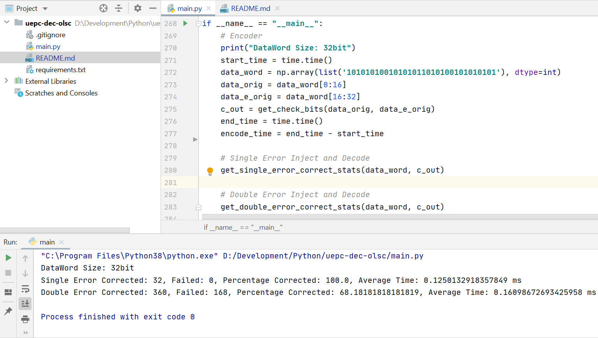

**Course:** CSE 6581 (Soft Error Tolerance) Khulna University of Engineering and Technology

# Introduction

Implemented for all possible combinations of data-word for both single and double error detection and correction.

**IEEE Journal Name:** Unequal-Error-Protection Error Correction Codes for the Embedded Memories in Digital Signal Processors 

# Getting Stated

## Setup Environment

Install Python3 and PIP and then run following commands

    git clone https://github.com/mdmamunhasan/uepc-dec-olsc.git
    cd uepc-dec-olsc
    pip install -r requirements.txt
    
## Execute

    python main.py

# Execution Result

## Environment

- Processor: Core i5 10th Gen 1035G1
- Memory: 8GB 
- Python: 3.8

## Output

**DataWord Size:** 32bit

| Error Type | Corrected | Failed | Percentage Corrected | Average Time |
| ---------- | --------- | ------ | -------------------- | ------------ |
| **Single Error** | 32 | 0 | 100.0 | 0.1250132918357849 ms |
| **Double Error** | 360 | 168 | 0.6818181818181818 | 0.16098672693425958 ms |

# Reference

- https://ieeexplore.ieee.org/document/7334457/
